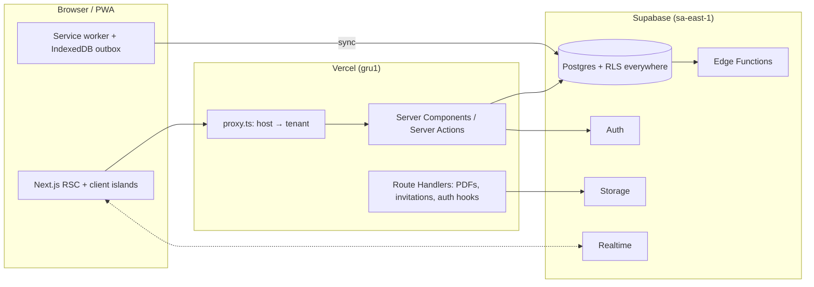

# Pauta Escolar

**The pedagogical class diary — auditable and pleasant to use.**
A multi-tenant school-management SaaS for Brazilian middle and high schools (Ensino Fundamental II e Médio). Secretaria, teachers and families work on a single record, each with exactly what belongs to them.

> **Status: under construction.** Milestone **M0 (foundation)** is in progress. The public demo, screenshots and GIFs arrive with M8–M9. The full plan is in [`docs/PLAN.md`](docs/PLAN.md).

## Why

The Brazilian market is split in two:

- administrative/financial ERPs with dated UX;
- family-messaging apps with little pedagogical depth.

Pauta Escolar sits in the middle, around the class diary itself:

- **Radar pedagógico.** An explainable early-warning risk index per student, built from attendance, grade trends, subjects below the minimum and recent incidents. Each alert says _why_.
- **Immutable diary.** An append-only audit log written by Postgres triggers and hash-chained per school. Every grade has a timeline: entered → closed → corrected.
- **Verifiable documents.** Report cards and enrollment/transfer statements as PDFs with a QR code and a public verification page.
- **Offline-first attendance.** A PWA with a local queue that syncs when the connection returns.
- **Real multi-school.** A teacher in two schools, or a guardian with children in different schools, uses a single account.

## Architecture



Key decisions are recorded as ADRs:

| ADR                                                  | Decision                                                                                |
| ---------------------------------------------------- | --------------------------------------------------------------------------------------- |
| [0001](docs/adr/0001-technology-stack.md)            | Stack: Next.js 16, React 19, TypeScript strict, Tailwind v4, Supabase                   |
| [0002](docs/adr/0002-multi-tenancy.md)               | Shared schema + RLS + composite tenant foreign keys; tenant resolved from the subdomain |
| [0003](docs/adr/0003-authentication-and-identity.md) | Invitation-only accounts; students log in with school code + matrícula                  |
| [0004](docs/adr/0004-append-only-audit-log.md)       | Trigger-written, append-only, per-tenant hash-chained audit log                         |
| [0005](docs/adr/0005-grade-engine-and-scales.md)     | Scale-agnostic grade engine with normalized storage and TS/SQL parity tests             |
| [0006](docs/adr/0006-environments-and-demo.md)       | Environments and an isolated, daily-reset public demo                                   |

## Tech stack

Next.js 16 (App Router, Cache Components) · React 19 · TypeScript (strict) · Tailwind CSS v4 · Radix/shadcn · Supabase (Postgres, Auth, Storage, Realtime, Edge Functions) · Vitest · Playwright + axe · Storybook · pgTAP · Lighthouse CI · GitHub Actions · release-please.

## Running locally

Prerequisites: Node.js 24, pnpm 12 and Docker (for the database, from M1).

```bash
pnpm install
pnpm dev            # http://localhost:3000
pnpm storybook      # http://localhost:6006
```

See [`CONTRIBUTING.md`](CONTRIBUTING.md) for every script and for the workflow.

## Roadmap

| Milestone | Scope                                                      | Status      |
| --------- | ---------------------------------------------------------- | ----------- |
| M0        | Foundation: tooling, design tokens, CI/CD                  | In progress |
| M1        | Database schema, RLS, audit log, seed                      | Planned     |
| M2        | Auth and tenancy                                           | Planned     |
| M3        | App shell and design system                                | Planned     |
| M4        | Secretaria acadêmica                                       | Planned     |
| M5        | Professor                                                  | Planned     |
| M6        | Aluno e família                                            | Planned     |
| M7        | Governança (queues, audit, verifiable PDFs)                | Planned     |
| M8        | Signature features (Radar, offline attendance, push, demo) | Planned     |
| M9        | Launch                                                     | Planned     |

Post-v1 ideas are in [`docs/ROADMAP.md`](docs/ROADMAP.md).

## License

Proprietary. All rights reserved. The source is public for evaluation and portfolio purposes only; see [`LICENSE`](LICENSE). Security issues: see [`SECURITY.md`](SECURITY.md).
