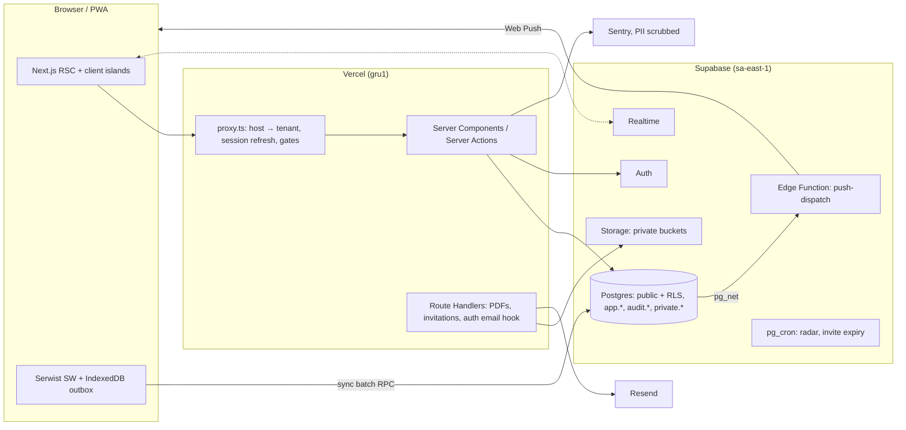

# Pauta Escolar — Delivery Plan

- **Status:** approved by the owner on 2026-10-06 (M0 in progress)
- **Last updated:** 2026-10-06
- **Scope:** v1.0.0 (milestones M0–M9)
- **Related:** [ADRs](adr/README.md) · [Design handoff](design/README.md) · `docs/ROADMAP.md` (created in M0)

Technical documentation is written in English. All UI copy is pt-BR, exactly as in the prototype.

---

## 0. Context

Pauta Escolar is a multi-tenant school-management SaaS for Ensino Fundamental II and Médio in Brazil. It is built from scratch to production quality and is the centerpiece of the owner's portfolio.

**Positioning:** the pedagogical class diary, auditable and pleasant to use. One record shared by the secretaria, teachers and families. It sits between the dated administrative ERPs and the family-messaging apps that offer little pedagogical depth.

### Inputs analysed

- `docs/design/README.md`: tokens, components, screens, motion, responsiveness, accessibility and states.
- The `<script type="text/x-dc" data-dc-script>` block of `docs/design/Secretaria Premium v2.dc.html` (lines 2498–3890), which holds the exact business rules.

Rules captured from the prototype for `src/domain`:

- **Grades**
  - The term total is the sum of the categories.
  - A term "closes" only when every category is filled. Until then the sheet shows "N campos pendentes".
  - Each category is validated against its own ceiling ("! máx X").
- **Composition** is valid only when the category sum equals the scale maximum. Messages: "Soma fechada em 10,0", "Excede 10,0 em X", "Faltam X pontos".
- **Situation**
  - Below the minimum: "Abaixo da média" (grade sheet) or "Recuperação" (boletim).
  - Below minimum + 1: "Atenção".
  - Otherwise: "Aprovado".
  - Always shown as icon + text (`✓ ! ↓`).
- **Recovery**
  - Eligible: complete and total < minimum.
  - Rules: `max(m, rec)` · `(m + rec) / 2` · `max(m, min(rec, minima))`.
  - The formula is shown to the user ("maior entre 4,5 e 6,5").
  - A recovery grade above the scale maximum is an error.
- **Attendance**
  - Colors: below the minimum → red; below 85 → amber; otherwise green.
  - Justified absences count as lessons given but do **not** count against the legal minimum (template line 1851).
- **Validations**
  - Refusal ≥ 10 characters; grade correction ≥ 20; incident ≥ 20.
  - Announcement title ≥ 4 and body ≥ 10.
  - Invite: name ≥ 5 characters plus email `/.+@.+\..+/`.
  - Transfer destination ≥ 5.
  - Password: 8+ characters, an uppercase letter and a number, with a 3-segment strength meter.
  - Tenant code: `^[a-z0-9-]{3,20}$` and different from the current one.
  - Wizard school name ≥ 5.
- **Tenant code auto-generation:** strip accents → drop {de, da, do, dos, das, e} → initials (max 6) + `-uf`.
- **Incidents**
  - Teachers can only apply "Registro pedagógico".
  - "Advertência escrita", "Suspensão" and "Transferência compulsória" require the guardian's signature.
  - "Destaque positivo" needs no acknowledgement.
- **Copy and timings:** every toast, every confirm dialog (Fechar lançamento, Cancelar matrícula, Alterar código) and every motion timing is specified in the prototype and is final.

### Environment

- **Available:** Windows 11, Node 24.16, npm 11, Git 2.55, Docker 29 (daemon running).
- **Missing:** pnpm, GitHub CLI, Supabase CLI. The Supabase CLI will be used as a devDependency (`pnpm supabase`).
- **MCPs:** Context7 and Playwright are available. The Supabase MCP needs OAuth (`/mcp`).
- **Project skills:** the skills in `.agents/skills` (supabase, postgres best practices, frontend-design) are mirrored into `.claude/skills` in M0 so they load automatically.

## 1. Product decisions confirmed (2026-10-06)

| Topic                | Decision                                                                                                                                                                                                                                                                                                |
| -------------------- | ------------------------------------------------------------------------------------------------------------------------------------------------------------------------------------------------------------------------------------------------------------------------------------------------------- |
| Grade entry          | **Numbers only.** Supported scales are 0–10 and 0–100, entered in scale units. "Conceitos A–E" is a **display mapping**: entry happens on 0–10, and the boletim, PDFs and portals show the concept through configurable bands. Storage is normalized ([ADR-0005](adr/0005-grade-engine-and-scales.md)). |
| Student first access | The secretaria generates a **provisional password** (printable access slip). The student must change it at first login. Every reset is audited.                                                                                                                                                         |
| Annual result (v1)   | **Informative:** annual average, attendance, situation and a frequency alert. Annual closing, final recovery and conselho de classe go to the ROADMAP.                                                                                                                                                  |
| Public demo          | **Separate Supabase project and separate Vercel project** at `demo.<root-domain>`, fully reset every day. The production audit log has **no exception** to append-only.                                                                                                                                 |

## 2. Architecture overview



## 3. Repository layout

```
src/
  app/
    (public)/            landing, entrar, esqueci-senha, redefinir-senha, verificar/[codigo],
                         privacidade, termos
    (platform)/plataforma/          super-admin (apex domain only, MFA aal2)
    t/[tenant]/          internal tenant root, reached by subdomain rewrite or /t/{code} (path mode)
      convite/[token]/   first access via invitation (tenant-scoped link, see ADR-0003)
      secretaria/ professor/ aluno/ familia/   role areas (each layout guards its role)
    dev/design-system/   development only (notFound() in production)
    api/                 route handlers
    not-found.tsx  error.tsx  global-error.tsx  forbidden.tsx
  components/ui/         design system (Storybook)
  components/<feature>/  feature components, incl. shared screens mounted under several role areas
                         (comunicados, calendario, conta, ocorrencias)
  domain/                pure business rules, 100% coverage
  schemas/               Zod schemas shared by client, server and Edge Functions
  lib/                   supabase clients, tenancy, auth, format (pt-BR), motion, rate limiting, email
  hooks/  emails/ (React Email)  sw/ (service worker source)
supabase/  config.toml  migrations/  seed.sql  tests/ (pgTAP)  functions/  templates/
scripts/   seed.ts (local + demo), gen-parity-tests.ts
docs/      PLAN.md  ROADMAP.md  adr/  design/  screenshots/<milestone>/
e2e/       Playwright specs + axe + visual baselines
.storybook/  .github/ (workflows, templates, dependabot)
```

**Refinement over spec §4.2: role segments instead of route groups.** URLs carry the role: `/secretaria/...`, `/professor/...`, `/aluno/...`, `/familia/...`.

- Several roles share slugs (`notas`, `frequencia`, `comunicados`), so route groups would collide.
- The segment becomes an explicit authorization boundary.

URL slugs are user-facing UI, so they are pt-BR. Code identifiers are English.

## 4. Tenancy, auth and security model

This section summarizes the model. The details live in ADRs 0002–0004.

### Tenancy ([ADR-0002](adr/0002-multi-tenancy.md))

- **Data model:** shared schema with `tenant_id uuid not null` on every domain table, RLS, and **composite foreign keys** `(tenant_id, parent_id) → parent(tenant_id, id)`. A cross-tenant reference is impossible at the schema level.
- **Host resolution in `proxy.ts`** (Next 16, Node runtime):
  - `{code}.<root>` is rewritten to `/t/{code}/…`.
  - The apex serves the public pages, `/entrar` and `/plataforma`.
  - Reserved codes: `www app admin api demo plataforma static assets` and similar.
- **Modes:**
  - Development defaults to `TENANCY_MODE=path` (`localhost:3000/t/{code}/…`); `subdomain` (`{code}.localhost:3000`) is also available.
  - E2E runs in path mode, plus one subdomain smoke test.
  - The demo deployment uses `single`.
- **Session cookie:** scoped to `.<root>` in production, so one login covers users who belong to several schools.
- **Authorization:** the URL only _selects_ the tenant. Authorization is always membership + RLS on the row's `tenant_id`. Nothing that comes from the client is trusted.
- **Multi-school users:**
  - The sidebar school switcher already exists in the prototype ("E. M. Jardim Botânico ▾").
  - Guardian dependent chips span tenants and show each child's school. Picking a child from another school switches host transparently.
  - A user with several roles in one tenant gets a role switcher. The active role comes from the URL segment and is validated against memberships.
- **Tenant code change:**
  - The old code stops working immediately, as designed.
  - `tenants.sessions_valid_after` forces every user to log in again.
  - Pending invitation links (tenant-scoped) become invalid and must be resent, matching the confirm-dialog copy.
  - The change is recorded in `tenant_code_history` and audited.

### Authentication ([ADR-0003](adr/0003-authentication-and-identity.md))

- **Email users:** Supabase Auth with email and password for the secretaria, teachers, guardians and platform admins.
- **Students** sign in with **school code + matrícula + password**.
  - Internally this maps to `{registration_code}@{tenant_uuid}.students.pauta.internal`. The tenant UUID is immutable, unlike the code, and `.internal` is ICANN-reserved.
  - These accounts are created through the admin API with a confirmed email and never receive mail.
- **Login on the apex `/entrar`**, following the prototype:
  1. The user types the school code and sees "✓ Escola …".
  2. The user enters an email or matrícula plus the password.
  3. A Server Action validates the input with Zod and applies the rate limit and lockout. After 5 failures the account is temporarily locked and the audit records "Conta bloqueada após 5 tentativas".
  4. `signInWithPassword` runs, the access event is audited, and the user is redirected to the tenant host.
- **Provisional passwords:** students get one from the secretaria. `app_metadata.must_change_password` makes `proxy.ts` force `/trocar-senha`.
- **Forgot password:** email users get a PKCE email link. Students see "Procure a secretaria".
- **Auth emails** go through the Supabase **Send Email hook** to a route handler that renders React Email (pt-BR), sends via Resend and drops synthetic domains. This is verified at M2; the fallback is custom SMTP with generated templates.
- **Invitations** use our own table instead of `inviteUserByEmail`.
  - The token is hashed with SHA-256 and expires after 7 days. Status: pending, accepted, expired or revoked.
  - The link opens **Primeiro acesso** (LGPD consent, password strength meter).
  - Acceptance creates or links the user and activates the membership server-side.
- **Platform admins** must use **TOTP MFA**. `app.is_platform_admin()` requires `aal2`.
- **Session checks:** server code uses `getClaims()` (verified JWT) and never `getSession()`. The service-role client is wrapped in `server-only` and guarded by ESLint.

### Audit ([ADR-0004](adr/0004-append-only-audit-log.md))

- **Storage:** `audit.audit_log` lives in a schema that is not exposed to the Data API.
- **Write path:** only Postgres triggers on audited tables write to it, plus one service-role-only RPC for access events.
- **Append-only:**
  - `UPDATE`, `DELETE` and `TRUNCATE` are revoked from every role, service_role included.
  - Guard triggers raise on any of them.
  - pgTAP proves both.
- **Hash chain per tenant:**
  - Each entry stores `seq`, `prev_hash` and `hash = sha256(prev_hash ‖ canonical payload)`.
  - Writes are serialized with a per-tenant `pg_advisory_xact_lock`.
  - `audit.verify_chain(tenant)` returns the first broken link. It is exposed to the super-admin in M7.
- **Payload:** a before/after diff of the changed columns, with PII minimized.
- **Grade timeline:** lançada → fechada → retificada → reaberta, derived from the audit log, locks and correction requests.
- **Known limitation:** a database superuser could rewrite a whole chain. External anchoring of chain heads is on the ROADMAP.

### Security baseline (spec §4.3, applied everywhere)

- **RLS:**
  - RLS is enabled on 100% of exposed tables.
  - There is **one permissive policy per (table, command)**.
  - Policies are always `to authenticated`; UPDATE policies have both `USING` and `WITH CHECK`.
- **Helpers** live in the `app` schema as `security definer stable set search_path = ''` functions, with `EXECUTE` revoked from `public` and `anon`.
  - Policies use **row-independent, set-returning helpers** inside `(select …)`, so the planner evaluates them once per statement. Examples: `tenant_id in (select app.tenant_ids_with_role('{secretary}'))`, `student_id in (select app.guardian_student_ids())`, `class_subject_id in (select app.taught_class_subject_ids())`.
  - Boolean helpers (`app.has_role`, `app.is_guardian_of`, `app.teaches`, `app.is_platform_admin`) are used inside RPC bodies.
- **Grants:** every table gets explicit GRANTs. `anon` may only call `public.resolve_tenant(code)` and `public.verify_document(code)`.
- **Critical rules live in the database:**
  - A grade-lock trigger blocks writes to locked grades.
  - Approved corrections and lock reopenings run through `security definer` functions owned by a dedicated role. The lock trigger allows only that `current_user`.
- **CPF:**
  - The CPF column is revoked from `authenticated`; the UI only receives a masked generated column.
  - The full value reaches only the secretaria, through an audited RPC.
- **Storage:**
  - Private buckets `attachments` and `documents`, with paths `{tenant_id}/{entity}/{uuid}.{ext}`.
  - Limit of 20 MB and a MIME allowlist (pdf, jpeg, png, webp, heic).
  - Policies on `storage.objects`; downloads use signed URLs valid for 60 s.
- **Rate limiting:** a Postgres limiter (`private.rate_limit_hit(key, max, window)`) protects login, invitations and `/verificar`.
- **Headers:**
  - Nonce-based CSP, HSTS, `frame-ancestors 'none'` / `X-Frame-Options: DENY`, Referrer-Policy and Permissions-Policy.
  - Server Actions `allowedOrigins` covers `*.<root>`.
- **LGPD:**
  - Collect only the minimum.
  - Consents are stored with version and timestamp.
  - `data_subject_requests` supports export and anonymization, within the school's record-retention duties.
  - Sentry runs with `sendDefaultPii: false` and a `beforeSend` scrubber; logs carry no PII.
- **Regions:** Supabase `sa-east-1`, Vercel functions `gru1`.

## 5. Data model (refined from spec §4.4)

Scores are stored normalized as `numeric(7,6)` in 0..1 ([ADR-0005](adr/0005-grade-engine-and-scales.md)). Every table carries `tenant_id` and RLS unless it is platform-level.

- **Platform**
  - `tenants`: code (citext, unique), name, acronym, network, city, uf, status (active | onboarding | trial | suspended), sessions_valid_after.
  - `tenant_code_history`, `platform_admins`.
  - `school_settings`:
    - Grading: grade_scale (`0_10` | `0_100` | `concept_a_e`), concept_bands, decimals, min_grade, recovery_rule, attention_band.
    - Calendar and attendance: term_type, min_attendance.
    - Radar: risk_config (jsonb).
    - The four portal toggles from Configurações.
- **Identity**
  - `profiles`: full_name, phone, notification preferences.
  - `memberships`: user, tenant, role (`secretary` | `teacher` | `student` | `guardian`), status (invited | active | suspended | revoked). Unique per user, tenant and role.
  - `invitations`, `consents` (document, version, accepted_at), `private.auth_attempts`.
- **People.** These records exist before any auth user; `user_id` is filled when the invitation is accepted.
  - `teachers`: status (ativo | carga incompleta | licença), contracted_hours.
  - `students`: registration_code (unique per tenant), birth_date, cpf, address, emergency phone, authorized pickups.
  - `guardians`, `student_guardians` (relationship, portal_access).
  - A guardian with children in several schools has one `guardians` row per tenant, all linked to the same `user_id`.
- **Academic**
  - `academic_years`.
  - `terms`: ordinal, dates, grade_closing_due_on, weight (default 1).
  - `classes`: stage (ef1 | ef2 | em), grade_level, shift, capacity, room, homeroom teacher.
  - `subjects`, `class_subjects` (teacher, weekly workload).
  - `enrollments` (status active | transferred | cancelled | reassigned, origin, destination_school) and `enrollment_events` (lifecycle timeline). On reassignment, grades and attendance follow the student, as in the prototype.
- **Assessment**
  - `assessment_compositions` (school default or per-subject override; draft | published) and `assessment_categories` (name, max_score, position). Publishing requires the category sum to equal the scale maximum, enforced by a trigger.
  - `grades`: student, subject, term, category, class_subject, score.
  - `grade_locks`: class_subject and term; locked and reopened at/by/reason; recovery_closed_at.
  - `recovery_grades`.
  - `grade_correction_requests`: current and proposed score, justification ≥ 20, status, decision reason ≥ 10.
- **Attendance**
  - `attendance_sessions`: class_subject, date, lesson count.
  - `attendance_records`: P | F | J, `client_updated_at` for last-write-wins, `op_id` for idempotency.
  - `absence_justifications`: with attachment. Approval sets J through a function.
- **Conduct**
  - `incidents`: type, measure, suspension_days, description ≥ 20, author.
  - `incident_acknowledgements`: guardian acknowledgement (ciência) and click-wrap signature.
- **Communication**
  - `announcements`, `announcement_audiences`, `announcement_reads`. A recipient_count snapshot drives "% leram".
  - `class_topics`, `class_posts` (notice | activity | material, due_date, attachment), `class_post_comments`, `post_views`, `post_completions` (with attachment).
- **Calendar**
  - `calendar_events`: scope (school | class); kind (exam | meeting | holiday | term_closing | other).
  - Term-closing events are derived from `terms`.
- **Notifications:** `notifications` (Realtime), `notification_preferences`, `push_subscriptions`, `notification_outbox`.
- **Radar**
  - `risk_snapshots`: score, level, factors (jsonb with params), status.
  - `risk_actions`: summon_guardian | follow_up | resolved, plus a note.
- **Documents:** `issued_documents` with type, student, verification_code, sha256, storage_path, a minimal snapshot and revoked_at.
- **Governance:** `audit.audit_log`, `data_subject_requests`.
- **Search:** `pg_trgm` and `unaccent` indexes on students, classes and teachers, for ⌘K.

## 6. Domain engine (`src/domain`, pure TypeScript, 100% coverage)

| Module        | Responsibility                                                 |
| ------------- | -------------------------------------------------------------- |
| `numbers`     | Parse and format pt-BR numbers ("5,5" ⇄ 5.5); half-up rounding |
| `scale`       | Normalize ⇄ display; concept bands; ceiling validation         |
| `composition` | Category sum; publish validation and messages                  |
| `grades`      | Term total; completeness; pending fields                       |
| `averages`    | Term average; weighted annual average                          |
| `recovery`    | The 3 rules, formula text, eligibility and result              |
| `situation`   | Enum → icon + label + tone                                     |
| `attendance`  | Raw % and legal %; alert bands                                 |
| `risk`        | Radar index and pt-BR explanations                             |
| `enrollment`  | Lifecycle state machine                                        |
| `invitations` | Status and relative text ("enviado 20/09 · expira em 5 dias")  |
| `codes`       | Tenant-code auto-generation, reserved list, verification codes |
| `names`       | Initials; deterministic avatar colors                          |
| `masking`     | CPF; partial names for `/verificar`                            |
| `dates`       | `America/Sao_Paulo` via `@date-fns/tz`; pt-BR relative labels  |
| `terms`       | Labels from term_type ("2º trimestre", "2º tri")               |

**Rounding rule.** Threshold comparisons use the value **rounded to display precision**, so what users see is what gets evaluated. This fixes a prototype edge case where 5,97 displays as "6,0" but evaluates as recovery. The default is to be confirmed at M4.

**Parity between TypeScript and SQL.**

- Rules that also run in SQL (recovery, term total, attendance %, risk) share fixtures in `src/domain/__fixtures__/*.json`.
- Vitest consumes the fixtures directly.
- `scripts/gen-parity-tests.ts` generates pgTAP tests from the same cases. CI fails if the generated files are stale.

## 7. Frontend system

- **Tokens:** `src/styles/tokens.css` defines every README token as a CSS variable (`--color-ink`, …, shadows, radii, motion). Tailwind v4 maps them through `@theme inline`. The structure is ready for a `[data-theme=dark]` override, which is on the ROADMAP.
- **Fonts:** Sora, Instrument Sans and IBM Plex Mono via `next/font`, with `display: swap`.
- **Components** (Storybook, every state):
  - Buttons and pills: Button (primary, secondary, danger, ghost), Chip, StatusPill, Badge.
  - Forms: Input, Field, FieldError, Select, Toggle, SegmentedControl.
  - Layout and data: Card, DataTable (TanStack Table + Virtual), Avatar, KpiCard + CountUp, Sparkline, Calendar (month and agenda).
  - Feedback: EmptyState, Skeleton (shimmer), Toast (sonner, styled per the README), SuccessCheck (animated SVG).
  - Overlays: ConfirmDialog (alertdialog, 460px, typed-confirmation variant), SidePanel (440px), BottomSheet, Modal/Wizard + Stepper.
  - CommandPalette (cmdk).
- **Primitives and icons:** Radix/shadcn primitives (Dialog, AlertDialog, Sheet, Select, Popover, Tabs, Tooltip) are fully restyled. Unicode glyphs map to Lucide icons (mapping table in CLAUDE.md).
- **Motion** (`src/lib/motion.ts` plus a central `useReducedMotion`):
  - Module change: only `<main>` animates (opacity plus translateY 7 → 0, 200 ms, `cubic-bezier(0.16, 1, 0.3, 1)`).
  - Stagger: on screen entry only; 220 ms, delay `30 ms + min(i, 14) × 30 ms`, at most 40 items.
  - KPI count-up: 750 ms, ease-out cubic.
  - Modals, panels and sheets: open in 220 ms, close in 140 ms with `cubic-bezier(0.4, 0, 1, 1)`; the overlay fades in 180 ms.
  - Success check: scale 320 ms plus a 340 ms stroke draw with a 120 ms delay.
  - Hover and focus transitions: 120 ms.
  - With reduced motion, only opacity remains.
- **States:** every data screen has a skeleton (`aria-busy`), an empty state, an error state ("Tentar de novo") and a success toast. Irreversible actions go through the ConfirmDialog.
- **Accessibility:**
  - WCAG 2.2 AA, 44 px touch targets, and the README focus-visible ring.
  - The grade-sheet and attendance keyboard models are implemented exactly as specified.
  - Situations always show icon + text.
  - Zero axe violations.
- **Data:**
  - Server Components by default.
  - Server Actions validate with Zod, then call Supabase as the user (RLS) or a narrowly scoped RPC.
  - TanStack Query is used only in interactive islands: grade sheet, attendance, notifications, ⌘K and filtered tables.
- **Fidelity loop:** a screen is not done until Playwright MCP compares it side by side with the prototype at 390, 768 and 1280 px. Reference screenshots go to `docs/screenshots/<milestone>/`.
- **New screens** follow the v2 tokens, using the frontend-design skill: Calendário, Redefinir senha, Atividades do dependente, the Reabrir lançamento dialog, Radar pedagógico, `/verificar`, Minha conta, 404/403/500 and the landing page.

## 8. Quality gates and CI

- **Lint and format:**
  - ESLint 9 flat config: typescript-eslint strictTypeChecked, jsx-a11y, import-x, react-hooks, next, storybook.
  - Prettier with the Tailwind class-sorting plugin.
  - Zero warnings.
- **Unit tests:** Vitest and Testing Library. `src/domain` has a 100% threshold on lines, branches, functions and statements.
- **Database tests:** pgTAP via `supabase test db`, covering:
  - the tenant isolation matrix and the role matrix;
  - audit immutability and the hash chain;
  - grade locks, corrections and storage policies;
  - the TS/SQL parity cases.
- **E2E:**
  - Playwright with `@axe-core/playwright` on every screen.
  - Visual baselines are generated only inside the official Playwright Linux container. Windows developers run `pnpm e2e:docker`.
- **`ci.yml` pipeline:**
  1. Lint, then typecheck, then unit tests.
  2. Database job: `supabase start` → reset → pgTAP → `supabase db advisors` → generated-types drift check.
  3. Build.
  4. E2E with axe.
  5. Lighthouse CI.
  - Also runs `pnpm audit --audit-level=high`, cancels superseded runs and caches dependencies.
- **Other workflows:**
  - `release.yml`: release-please with `bump-minor-pre-major`; M0 uses `release-as: 0.1.0`.
  - `pr-title.yml`: Conventional PR titles, since PRs are squash-merged.
  - `reset-demo.yml`: added in M8.
  - Dependabot: npm and GitHub Actions, grouped, weekly.

## 9. Git workflow

- **Bootstrap:**
  1. `git init` on `main`.
  2. Make a docs-only initial commit (design handoff, PLAN, ADRs).
  3. Push to `github.com/JoaoGabrielMSantos/pauta-escolar` (inferred from the git config; to be confirmed).
  4. Protect `main`.
- **After bootstrap:**
  - Every change goes through a PR. Branches follow `chore/m0-foundation`, `feat/m1-schema-rls`, `fix/...`.
  - Commits follow Conventional Commits (commitlint, husky, lint-staged) and stay small and atomic.
  - There is one PR per milestone, using the template: what and why, screenshots, a checklist (tests, a11y, advisors, migrations) and "como testar".
  - PRs are squash-merged; release-please tags `v0.(n+1).0`.
- **Migrations** are hand-written imperative SQL (`supabase migration new`), so grants, policies and triggers stay explicit. They are immutable after merge; corrections go in a new migration.

## 10. Milestones

Every milestone ends with:

- tests green;
- a PR opened;
- a summary with screenshots and a list of pending items;
- CLAUDE.md updated;
- Supabase advisors at zero, when the database changed;
- a release tag.

**I stop for owner review after each milestone.** Sizes are relative (M < L < XL).

### M0 — Foundation → `v0.1.0` (M)

**Tasks**

- Toolchain:
  - pnpm (`npm i -g pnpm`) and Node 24 pinned through `.nvmrc` and `engines`.
  - `.editorconfig` and `.gitattributes` (LF line endings).
- Next.js 16 (App Router, Turbopack) with TypeScript strict, `noUncheckedIndexedAccess` and `noImplicitOverride`, plus the `@/` alias.
- Tailwind v4 with `tokens.css` (every README token) and the three fonts.
- shadcn initialized with the Radix primitives; restyling happens in M3.
- Tooling:
  - ESLint and Prettier.
  - Vitest with coverage gates.
  - A Playwright + axe smoke test.
  - Storybook (`@storybook/nextjs-vite` with the a11y addon), with token stories for Colors, Typography, Spacing, Shadows and Motion.
- husky, lint-staged and commitlint.
- GitHub:
  - PR and issue templates.
  - CONTRIBUTING, SECURITY, LICENSE, Dependabot and CODEOWNERS.
- Workflows: `ci.yml` (with the database job stubbed until M1), `release.yml`, `pr-title.yml`.
- `supabase init` (configuration only).
- A `/dev/design-system` placeholder, available in development only.
- Docs:
  - `CLAUDE.md`, `docs/ROADMAP.md` and a README skeleton.
  - Mirror `.agents/skills` into `.claude/skills`.

**Done when:** CI is green on the PR, Storybook builds with the tokens, `main` is protected and `v0.1.0` is released.

### M1 — Database and security → `v0.2.0` (L)

**Tasks**

- **Schema:**
  - Extensions: pgcrypto, citext, pg_trgm, unaccent, pg_cron.
  - The `app`, `audit` and `private` schemas, and the enums.
  - Every §5 table, with composite FKs and an index on every FK and on `tenant_id`.
- **RLS:** policies, helpers and explicit grants.
- **Triggers:** `updated_at`, composition sum, grade lock, audit capture with the hash chain, and invitation expiry (cron).
- **Privileged functions:** approve a correction, reopen a lock, apply a justification. The SQL versions of the domain rules.
- **Storage:** buckets and policies.
- **Seed (`scripts/seed.ts`):**
  - A realistic tenant `demo`: 5 classes, about 150 students, 3 terms of grades and attendance, risk patterns, invitations in mixed states, queued requests, announcements with reads.
  - A second tenant `escola-b` for the isolation tests.
  - Dates are relative to "today", so the data always looks current.
- **pgTAP:**
  - The full isolation matrix: every table × tenant A/B × every role × CRUD.
  - Audit immutability, including service_role.
  - Chain verification and tamper detection.
  - Lock enforcement and the correction flow.
  - Tenant consistency of composite FKs.
  - The parity fixtures.
- **Types and advisors:**
  - Generated types plus a drift check.
  - A hosted **prod** Supabase project (sa-east-1, free tier; cost confirmed before creation) for MCP `get_advisors`.
  - `supabase db advisors` running locally in CI.

**Done when:** pgTAP is 100% green in CI and the advisors report zero WARN/ERROR.

- INFO-level "unused index" findings on an empty database are documented.
- So is any gap that only exists on the Free plan, such as leaked-password protection.

### M2 — Auth and tenancy → `v0.3.0` (L)

**Tasks**

- **`proxy.ts`:**
  - Host or path → tenant, with reserved codes and a cached lookup.
  - Session refresh (`getClaims`).
  - The must-change-password gate and `sessions_valid_after`.
- **Supabase clients:** browser, server, and a server-only admin client.
- **`/entrar`**, pixel-faithful:
  - Login by email or matrícula.
  - Lockout and rate limiting, with the access audited.
  - A chooser for multiple tenants and roles, plus the school switcher.
- **Password reset:** Esqueci minha senha and Redefinir senha.
- **Email:**
  - Send Email hook → React Email + Resend.
  - Mailpit in development and E2E (`EMAIL_TRANSPORT=smtp|resend`).
- **Invitations:**
  - Create, resend and expire.
  - `/convite/[token]` → Primeiro acesso, with the LGPD consent recorded with its version.
- **Student access:** provisional-password service, printable access slip and forced password change.
- **`/plataforma`:**
  - KPIs, filters and the schools table.
  - The Nova escola wizard: tenant, settings, academic year, generated terms and the secretaria invitation.
  - TOTP MFA for platform admins.

**Done when:**

- The E2E flow "create school → invite secretaria → first access → login" passes, including the student login path.
- axe is clean.
- Login, Primeiro acesso and Plataforma pass the fidelity check.

### M3 — Shell and design system → `v0.4.0` (L)

**Tasks**

- All base components restyled, with stories for every state.
- **Role shells:**
  - Sidebar (252 px, or 216 px on tablet).
  - Sticky header: title and breadcrumb, term selector, ⌘K, notifications bell.
  - Mobile bottom nav: up to 5 items, or 4 plus "Mais" (a bottom sheet with the rest and "Sair da conta").
  - Dependent chips, the school switcher, and the demo role switcher (demo only).
- **Navigation per role:**
  - "Design system" is removed.
  - **Calendário** is added for every role.
  - Radar is added for the secretaria, and "Atividades e prazos" for the família.
- **System components:**
  - Notifications panel (Realtime), toasts, skeletons, ConfirmDialog, EmptyState.
  - 404, 403 and 500 pages plus the global error page.
- **Command palette:** role-scoped actions, a search RPC, and "G P"-style chords.
- The full motion system.

**Done when:** the visual comparison with the prototype is approved at all three breakpoints for every role shell, and axe is clean.

### M4 — Secretaria acadêmica → `v0.5.0` (XL)

**Tasks**

- **Painel:**
  - KPIs with real 8-month **sparklines** and the count-up animation.
  - Quick actions.
  - An activity feed built from the audit log.
  - A below-minimum list, upgraded by the Radar in M8.
  - Grade-closing progress.
- **Turmas:** cards or table, stage filters, CRUD, class_subjects.
- **Professores:** the staff board, the invitation column and panel, resend, workload.
- **Alunos:** table on desktop and cards on mobile, search, skeleton and empty state.
- **Ficha do aluno:**
  - Data, guardians and their invitations.
  - The lifecycle timeline.
  - Remanejar, transferir, cancelar and reativar.
  - Password reset with the access slip.
- **Nova matrícula:** sections 01–04, with several guardians and their invitations.
- **Configurações:** school data, rules, portal toggles, and the tenant code with typed confirmation.
- **Composição da nota:** slider, sum bar, per-subject overrides, publish.
- **Calendário:** month view on desktop and agenda on mobile; school events.
- **Boletins:** secretaria view.

**Done when:** the E2E for matrícula and the full lifecycle passes with audit entries asserted, and the fidelity check passes.

### M5 — Professor → `v0.6.0` (XL)

**Tasks**

- **Minhas turmas:** cards, the day's agenda, alerts.
- **Turma page:**
  - Mural: aviso, atividade or material, with topics, comments and attachments.
  - Atividades.
  - Pessoas.
- **Lançar notas:**
  - A spreadsheet with the keyboard model.
  - Sticky header and a sticky 236 px name column, inside a 72vh scroll area.
  - Inline "! máx X" validation and comma decimals.
  - Save as draft.
- **Fechar lançamento:**
  - Confirm dialog with the empty-fields warning.
  - Lock enforced in the database, and the locked UI.
  - The Solicitar retificação panel, then "◷ Retificação pedida" on the row.
- **Recuperação:** rule card, list of eligible students, visible formula, error above the maximum.
- **Chamada:**
  - Radiogroup with roving tabindex, plus the P/F/J, ←→, ↑↓ and Enter keys.
  - Cards on mobile.
  - Guardians of absent students are notified.
  - Online only; offline support comes in M8.
- **Ocorrências:** teacher view, plus the secretaria measures and suspension days.
- Class calendar events.
- The secretaria's Frequência screen.

**Done when:** the lock is proven in the database (pgTAP plus an E2E update attempt), and the E2E notas → fechamento → retificação request passes.

### M6 — Aluno and família → `v0.7.0` (L)

**Tasks**

- **Aluno:**
  - Minhas matérias (with skeleton).
  - The subject feed, with "marcar como entregue" and attachments.
  - Minhas notas: boletim with sparklines, cards on mobile, the composition breakdown.
  - Minha frequência, Ocorrências.
  - Comunicados (● Novo / ✓ Lido).
  - Calendário.
- **Família:**
  - Dependent chips across schools.
  - Boletim, Frequência and Ocorrências, with ciência and signature.
  - **Justificar falta** with upload; the request enters the secretaria queue.
  - **Atividades e prazos do dependente**, read-only.
  - Comunicados, Calendário.
- **Minha conta:** personal data, password change, notification preferences, consent history, LGPD export request.
- An installable PWA manifest.

**Done when:** the mobile (390 px) E2E of the family flows passes, including a switch to a dependent in another school.

### M7 — Governança → `v0.8.0` (L)

**Tasks**

- **Request queues** (Realtime):
  - Justificativas: approve (the absence is excused) or refuse with a reason ≥ 10.
  - Retificações: approve through the privileged function, or refuse with a reason ≥ 10.
- **Reabrir lançamento:** a secretaria dialog with a mandatory reason; audited.
- **Log de auditoria:**
  - Filters and a server-paginated, virtualized table.
  - Streamed CSV export.
  - Chain verification for the super-admin.
- **Grade timeline** in the student record.
- **Comunicados:** composer with computed audiences and reach, plus "% leram".
- **PDFs** (`@react-pdf/renderer`):
  - Boletim, declaração de matrícula and declaração de transferência.
  - Each with a QR code, a verification code, a SHA-256 hash and private storage.
- **`/verificar/[codigo]`:** public, masked and rate-limited. Optionally checks the hash of an uploaded PDF in the browser.

**Done when:** a document is verified through its QR URL, the audit chain validates, and pgTAP detects tampering.

### M8 — Assinatura → `v0.9.0` (XL)

**Tasks**

- **Radar pedagógico:**
  - Deterministic scoring in SQL, run nightly by pg_cron and on demand.
  - Weights and thresholds configurable per school.
  - Default factors:
    - attendance below the minimum;
    - attendance drop over 4 weeks;
    - downward grade trend;
    - subjects below the minimum;
    - recent non-positive incidents, weighted by severity.
  - Each alert shows its explanation in plain language.
  - Actions: convocar o responsável, registrar o acompanhamento, marcar como resolvido.
  - Parity tests between SQL and TypeScript.
- **Offline-first chamada:**
  - Serwist in configurator mode (works with Turbopack).
  - An IndexedDB outbox, synced on reconnect, on focus and through Background Sync.
  - A batch RPC with **per-record last-write-wins** on `client_updated_at` and `op_id` idempotency; conflicts are audited.
  - A "pendente de sincronização" indicator.
- **Web Push:**
  - VAPID keys and subscriptions.
  - Outbox → the `push-dispatch` Edge Function.
  - Preferences per notification type.
  - Cleanup of dead subscriptions.
- **Demo:**
  - The `pauta-demo` Supabase project and a Vercel project at `demo.<root>` with `TENANCY_MODE=single`.
  - The "Entrar como …" quick login, with demo credentials kept on the server.
  - Demo guards: emails, push and tenant-code change are simulated, uploads are capped, and a banner is shown.
  - `reset-demo.yml` runs daily: `db reset --linked` followed by `seed.ts`.

**Done when:** offline attendance syncs (Playwright `setOffline`), every Radar alert shows its "why", and the demo reset succeeds.

### M9 — Lançamento → `v1.0.0` (L)

**Tasks**

- A landing page with the portfolio pitch.
- Lighthouse ≥ 95 on all four categories (mobile), on the landing page and the main screens.
- A final accessibility and security review: headers and CSP, an RLS re-audit, rate limits, dependencies.
- Sentry, with PII scrubbed and a tunnel route.
- Production:
  - Vercel (gru1) and Supabase (sa-east-1).
  - The domain, with **wildcard DNS and TLS**.
  - The Resend sending domain.
- The portfolio README: pitch, GIFs, demo link, Mermaid diagram, security and tenancy decisions, local setup.

**Done when:** the public demo is live and stable, and `v1.0.0` is tagged.

## 11. Risks and mitigations

| Risk                                                                       | Mitigation                                                                                                                 |
| -------------------------------------------------------------------------- | -------------------------------------------------------------------------------------------------------------------------- |
| Pixel fidelity versus Radix/shadcn defaults                                | Use the primitives only for behavior and restyle 100% through tokens. Run the side-by-side MCP comparison on every screen. |
| Hash-chain lock contention on bulk grade saves (≈ 112 audit rows per save) | Lock per tenant, not globally. Benchmark in M1; fall back to one audit row per statement.                                  |
| Supabase Auth per-IP limits see Vercel's IP when login runs server-side    | Verify at M2 (forwarded IP header). Keep our own limiter and lockout. Fallback: email users sign in from the browser.      |
| Synthetic student emails triggering mail                                   | Accounts are created already confirmed; the Send Email hook drops `*.pauta.internal`; recovery is disabled for students.   |
| Cross-subdomain cookies and CSRF                                           | Cookie on `.<root>` only in production; Server Actions `allowedOrigins`; `SameSite=Lax`; Origin checks on route handlers.  |
| "Zero advisors" on the Free plan (leaked-password protection is Pro-only)  | Document the exception, or upgrade before M9. Owner's call.                                                                |
| Serwist + Turbopack maturity                                               | Configurator mode, which is bundler-agnostic. Re-check with Context7 at M8.                                                |
| iOS Web Push requires an installed PWA (iOS 16.4+)                         | Install prompt; in-app notifications as the baseline.                                                                      |
| Visual regression flakiness across operating systems                       | Generate baselines only inside the Playwright Linux container.                                                             |
| Wildcard domains on Vercel require Vercel nameservers                      | Decide the root domain before M9. Everything reads `NEXT_PUBLIC_ROOT_DOMAIN`.                                              |
| Free-tier projects pause after inactivity                                  | The daily demo reset keeps the demo active. Restore prod through the MCP when needed.                                      |
| Branch protection on private repos requires GitHub Pro                     | Keep the repository public (it is a portfolio piece).                                                                      |
| Scope size (10 milestones, two of them XL)                                 | Strict milestone gates. Anything new goes to the ROADMAP, not into the current milestone.                                  |

## 12. Prerequisites from the owner

1. **GitHub CLI**, needed before the M0 PR: `winget install --id GitHub.cli`, then `gh auth login`. Confirm the repository URL and that the repository is **public**.
2. **Supabase:**
   - Authorize the Supabase MCP via `/mcp` (needed from M1).
   - A Supabase account and org for `pauta-prod` (M1) and `pauta-demo` (M8).
   - Costs (free tier) are confirmed with you before anything is created.
3. **Resend** account and sending domain (M2). Mailpit covers development until then.
4. **Vercel** account (preview deploys optional from M3; production in M8–M9) and **Sentry** (M9).
5. **Root domain** (`pauta.app` or an alternative), decided before M9.

## 13. Open product questions

Each question is asked at the start of the milestone that needs it. A default is proposed for each.

| Milestone | Question                                                                  | Proposed default                                                        |
| --------- | ------------------------------------------------------------------------- | ----------------------------------------------------------------------- |
| M0        | License for the code?                                                     | MIT (portfolio-friendly) vs proprietary / source-available (commercial) |
| M4        | Concept bands?                                                            | A ≥ 9 · B ≥ 7,5 · C ≥ 6 · D ≥ 4 · E < 4                                 |
| M4        | Term weights for the annual average?                                      | Equal weights                                                           |
| M4        | Rounding?                                                                 | Half-up to 1 decimal; comparisons on the rounded value                  |
| M5        | Do justified absences stay out of the legal minimum, as in the prototype? | Yes, confirm                                                            |
| M6        | Wording and legal meaning of "assinatura digital" on incidents            | Click-wrap with audit, not ICP-Brasil                                   |
| M8        | Radar weights and thresholds; which events push to guardians by default   | To be proposed at M8                                                    |

## 14. Out of scope (goes to `docs/ROADMAP.md` in M0)

- Financial module (mensalidades, Pix, boletos) for private schools.
- Educacenso export, plus attendance reports for condicionalidades.
- Opt-in AI assistant per school, with minimized and anonymized data.
- Native app.
- Dark mode (the tokens are already CSS variables).
- Plans and per-tenant feature flags.
- **Annual closing, final recovery and conselho de classe.**
- Direct concept entry.
- SSO (Google Workspace for Education, gov.br).
- External anchoring of audit chain heads.
- i18n.

## 15. Documentation index

| Document                                            | Content                                                               |
| --------------------------------------------------- | --------------------------------------------------------------------- |
| [docs/adr/README.md](adr/README.md)                 | ADR index and template                                                |
| [ADR-0001](adr/0001-technology-stack.md)            | Technology stack and version policy                                   |
| [ADR-0002](adr/0002-multi-tenancy.md)               | Multi-tenancy, tenant resolution, URL structure and RLS pattern       |
| [ADR-0003](adr/0003-authentication-and-identity.md) | Authentication and identity, including student logins and invitations |
| [ADR-0004](adr/0004-append-only-audit-log.md)       | Append-only, hash-chained audit log                                   |
| [ADR-0005](adr/0005-grade-engine-and-scales.md)     | Grade engine, scales, rounding and attendance rules                   |
| [ADR-0006](adr/0006-environments-and-demo.md)       | Environments, configuration and the public demo                       |

`CLAUDE.md`, `docs/ROADMAP.md`, the README and all tooling are created in **M0**.

## 16. Verification

- **This step:** the owner reviews this plan and the ADRs. No executable artifact is produced.
- **Every milestone:**
  - Locally and in CI: `pnpm lint && pnpm typecheck && pnpm test --coverage && pnpm db:test && pnpm build && pnpm e2e && pnpm lhci`.
  - Supabase: `get_advisors` (security and performance) through the MCP, plus `supabase db advisors` in CI.
  - Playwright MCP compares every new or changed screen with the prototype at 390, 768 and 1280 px.
  - The PR includes screenshots, the checklist and "como testar".
